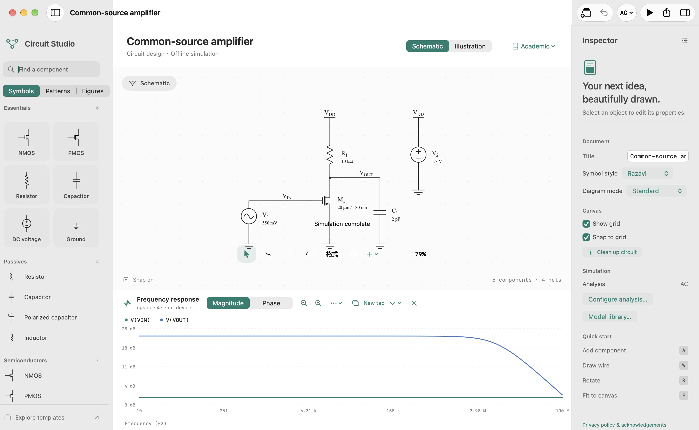
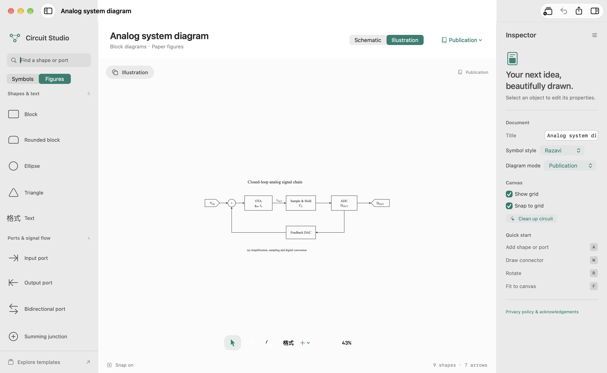

# Circuit Studio

A native Mac canvas for circuit design, offline simulation, and technical illustration.

[Website & Mac download](https://www.weitao-jiang.cn/static/circuit-studio/) · [Releases](https://github.com/CBDT-JWT/CircuitStudio/releases) · [Report an issue](https://github.com/CBDT-JWT/CircuitStudio/issues)



## Two canvas modes

Every new document starts with an empty canvas. Choose the mode in the canvas header:

- **Schematic**: circuit symbols, electrical wires and labels, voltage probes, and embedded ngspice 47 simulation. Operating point, DC, AC and transient analyses run locally.
- **Illustration**: block diagrams and paper figures, with 13 shapes including input/output/bidirectional ports, summing junctions, flowchart shapes, text, and attached arrows. Simulation tools are hidden and SPICE generation is disabled.

Switching modes preserves existing objects. The mode is stored with the document and can be undone. Older documents open automatically; pure figure documents become Illustration and electrical documents remain Schematic.

On Mac, the waveform panel offers **New tab** and **Open in new window**. Each expanded result is a snapshot of that analysis, so further circuit edits and simulations do not change an already-open result. AC magnitude/phase, zoom, cursors, and trace controls remain available.



## Install on Mac

Requires **macOS 26 or later**, on **Apple Silicon or Intel**. Download the universal DMG, open it, then drag **Circuit Studio.app** into **Applications**.

The current direct-download build uses an ad-hoc signature and **is not notarized by Apple**. If macOS blocks it, first attempt to launch the app, then choose **Open Anyway** in **System Settings → Privacy & Security**. See [Apple's instructions](https://support.apple.com/102445). Checksums and signature status are included in each release.

The app needs no account, network connection, Homebrew installation, or external simulation executable. Documents are ordinary `.circuit` packages; save them in iCloud Drive if desired.

## Drawing and export

- Vector circuit symbols including MOS, BJT, R/C/L, sources, op amp, supplies and connections.
- Grid snapping, attached endpoints, orthogonal routing, mathematical labels, selection, duplication, undo/redo, alignment and distribution.
- Native document windows and Mac keyboard shortcuts. Use **A** to search, **W** to draw a wire (or an illustration connector), **L** for arrows, **T** for labels/text, and **F** to fit.
- PDF/SVG vector export; PNG/JPEG/TIFF raster export; CircuitikZ import/export; SPICE netlists in Schematic mode.
- Publication styling, grayscale export, editable system diagrams, flowcharts and device cross-section examples.

The shared SwiftUI application also includes iPhone/iPad layouts. This release's downloadable installer is for macOS.

## Build

Use Xcode 27, including its command-line tools. The repository includes prebuilt ngspice static libraries for Mac, iOS and the iOS simulator, with their licenses and pinned source/build instructions.

```sh
xcodebuild -project CircuitStudio.xcodeproj -scheme CircuitStudio \
  -configuration Debug -destination 'platform=macOS' \
  -derivedDataPath /tmp/circuitstudio-build CODE_SIGNING_ALLOWED=NO build

swift test --scratch-path /tmp/circuitstudio-tests
```

The default app uses `DocumentGroup` and opens blank documents. `CIRCUITSTUDIO_PREVIEW` is only for deterministic screenshot and layout checks.

After adding Swift files, regenerate the project with `python3 scripts/generate_project.py`. To rebuild the embedded engine from the pinned upstream source, run `python3 scripts/build_ngspice.py` (requires Xcode and autotools).

## Package a DMG

```sh
python3 -m venv /tmp/circuitstudio-packaging
/tmp/circuitstudio-packaging/bin/pip install dmgbuild==1.6.7
/tmp/circuitstudio-packaging/bin/python scripts/package_macos.py
```

This creates a universal release build, verifies its signature and architectures, and builds a Finder disk image with an Applications link, background and installation instructions. Files and SHA256 checksums are written to `Release/Direct/`.

With a Developer ID Application certificate and an existing notarytool Keychain profile:

```sh
python scripts/package_macos.py \
  --sign-identity 'Developer ID Application: Your Name (TEAMID)' \
  --notary-profile YOUR_EXISTING_PROFILE
```

Credentials and signing overrides belong outside version control. Packaging does not upload to the App Store.

## Project structure

| Path | Purpose |
| --- | --- |
| `Sources/CircuitCore` | Document models, geometry, symbols, vector/raster export, connectivity, SPICE and simulation |
| `Sources/CircuitStudio` | Native document app, canvas, inspector, tools and waveform windows |
| `Tests/CircuitCoreTests` | Electrical, geometry, compatibility, export and real simulation checks |
| `scripts` | Project generation, engine builds, editor checks, screenshots and DMG packaging |
| `Vendor/ngspice` | Pinned engine, prebuilt XCFramework, build notes and licenses |
| `Website` | Static marketing site and actual application captures |

32 core tests and 17 editor interaction checks cover the current release's core behavior. Native UI checks additionally exercise blank startup, mode switching and simulation result tabs/windows. The document format is version 3, with backward compatibility for versions 1 and 2.

## Scope

Simulation supports OP/DC/AC/TRAN and native `.model` / `.param` definitions. XSPICE dynamic code models, OSDI plugins, Noise and Monte Carlo are not included. CircuitikZ import supports the app's own metadata and a limited subset of external numeric-coordinate circuit syntax. Device cross-sections are illustrations. Arbitrary Bézier editing, Visio import, hierarchy, CloudKit conflict handling, Quick Look extensions and full cross-device Handoff validation remain future work.

## License

Application source: [MIT](LICENSE). ngspice and its incorporated third-party code retain their own licenses in [Vendor/ngspice/COPYING](Vendor/ngspice/COPYING). The full engine notice also ships inside the app. Original artwork and asset provenance are documented in [Website/ASSETS.md](Website/ASSETS.md).
